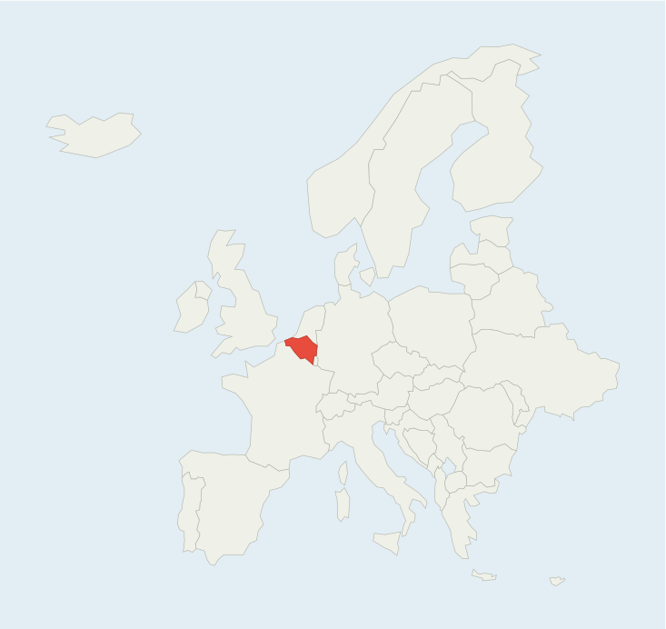

# Flashcards

A **zero-dependency** flash card app using SM-2 spaced repetition. Everything is in a single `index.html` — no build tools, no server, no external files except map images.

## Quick start

1. Open `index.html` in a browser — splash appears, click **Start Studying**.
2. Press **Space** to flip, **1-6** to grade (No Idea / Vague / Almost / Hard / Good / Easy).
3. Click **Settings** (gear icon) → **Reset Progress** to start over.

## File structure

```
flashcards-app/
├── index.html           # Standalone app (HTML + CSS + JS + config + cards)
├── favicon.ico          # Tab icon
├── README.md            # This file
└── assets/
    └── images/maps/     # Country map SVGs (48 files)
```

## Configuration (`APP_CONFIG`)

Open `index.html` — the first `<script>` block contains `APP_CONFIG` with these fields:

| Key | Type | Notes |
|-----|------|-------|
| `appId` | string | Unique identifier for this deck. **Change when duplicating** to keep separate `localStorage`. |
| `deckTitle` | string | Shown on splash and study header. |
| `dailyNewLimit` | number | Max new cards per session. |
| `dailyDueCardsLimit` | number | Max due cards pulled into session per day. |
| `maxReviewsPerSession` | number | Safety cap on total grades per session. |
| `maxCardsToRehearse` | number | Cards added to end of session for extra practice. |
| `extraCardsOnComplete` | number | Bonus cards shown when daily queue is done. |
| `gradeTimings` | object | Per-grade delay in seconds before re-queue (e.g. `"noidea": 60`). |
| `storageKeyPrefix` | string | Prefix for `localStorage` keys (default `fc_`). |

## Card data (`CARDS`)

Right below `APP_CONFIG` in the same `<script>` block, the `CARDS` array holds every card as `{ question, answer }`. HTML is allowed in both fields.

```js
{ question: "Capital of France?", answer: "Paris" },
{ question: "", answer: "Belgium" },
```

To change the deck, edit this array. Use **single quotes** for HTML attributes to avoid escaping issues.

## Grade system

| # | Grade | SM-2 | Session | Delay |
|---|-------|------|---------|-------|
| 1 | No Idea | fail | re-queue | 60s |
| 2 | Vague | fail | re-queue | 60s |
| 3 | Almost | fail | re-queue | 30s |
| 4 | Hard | pass | re-queue | 180s |
| 5 | Good | pass | resolve | — |
| 6 | Easy | pass | resolve | — |

Grades 1-3 reset SM-2 progress (repetitions, ease). Grades 4-6 advance it. Grades 5-6 remove the card from the current session.

## Keyboard shortcuts

| Key | Where | Action |
|-----|-------|--------|
| `Space` / `Enter` | Study | Flip card |
| `1` | Study | Grade: No Idea |
| `2` | Study | Grade: Vague |
| `3` | Study | Grade: Almost |
| `4` | Study | Grade: Hard |
| `5` | Study | Grade: Good |
| `6` | Study | Grade: Easy |
| `D` | Study | Cycle theme (auto → light → dark) |
| `Esc` | Study | Back to splash |
| `Enter` / `Space` | Splash | Start studying |

## Deployment

The whole folder is a self-contained static site. Drop it on any host.

### GitHub Pages
Push to a repo. Settings → Pages → Source: `main` branch, root.

### Netlify
Go to <https://app.netlify.com/drop>, drag the folder.

### Vercel
```bash
cd flashcards-app
npx vercel --prod
```

### Cloudflare Pages
Dashboard → Pages → Create → Direct Upload. Drag the folder.

### SharePoint
Upload `index.html` + `assets/` folder to a SharePoint document library. No server-side config needed.

### `file://` (local)
Double-click `index.html`. Works in any browser.

## How to create a new deck

1. **Copy `index.html`** to a new location.
2. Change `appId` (unique per deck for separate `localStorage`), `deckTitle`, and limits.
3. Edit or replace the `CARDS` array with your own question/answer pairs.
4. Drop images into `assets/images/`.
5. Open `index.html` or deploy.

Different `appId` = completely separate `localStorage` state. Host many decks on the same domain with no interference.

## Local storage

Keys prefixed with `config.storageKeyPrefix` (default `fc_`):

| Key | Content |
|-----|---------|
| `<prefix>cards` | `[{id, ease, intervalDaysUntilNextReview, repetitionsOfSuccess, dueDateOfNextReview, lapsesOfFailed, lastReview, lastGrade}]` |
| `<prefix>stats` | `{totalReviews, streakDays, lastStudyDate, newToday, dueToday, lastDay}` |
| `<prefix>settings` | `{darkMode: "auto"\|"light"\|"dark"}` |
| `<prefix>meta` | `{created, version, cardHash}` |

`meta.cardHash` is a hash of the embedded `CARDS` array. When the card data changes, SRS state resets automatically while keeping stats and settings.

## Browser support

Any browser with `localStorage` and CSS Grid — Chrome, Firefox, Edge, Safari (desktop + mobile). Works on `file://`, SharePoint, and strict CSP environments. No `fetch()` or `crypto.subtle` required.

## License

Public domain / CC0.
